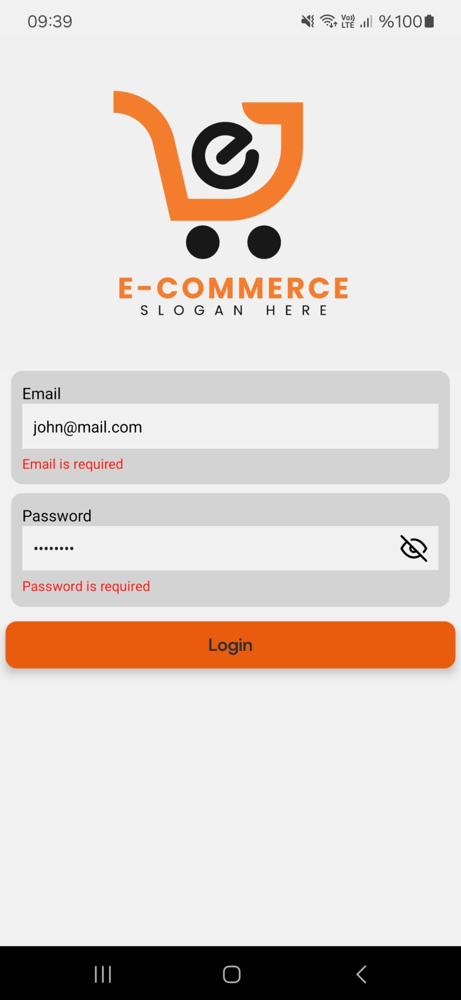
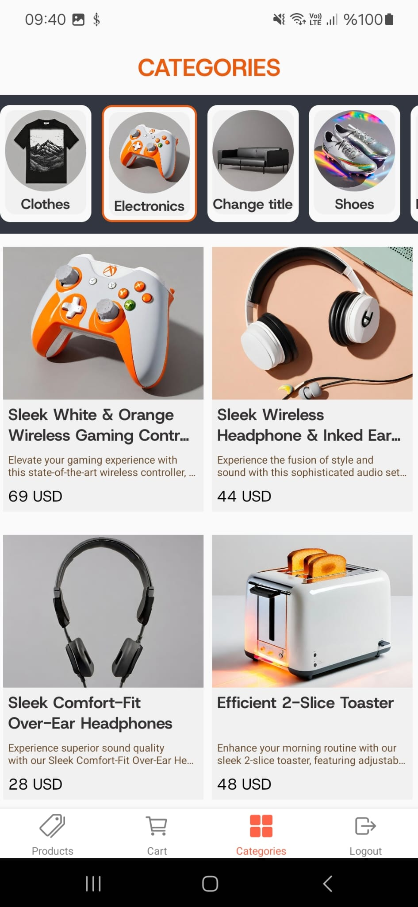
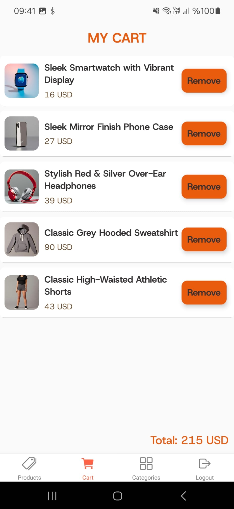
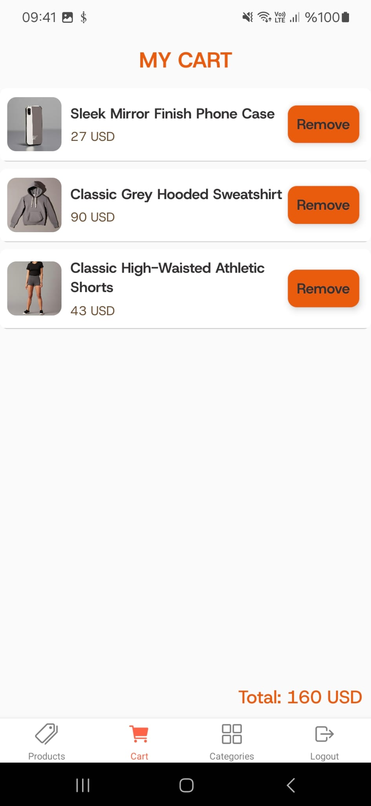

# MF101 Shop

Welcome to **MF101 Shop**, an e-commerce application developed as an assignment for the **Siliconmade Academy Course**. This app demonstrates core features of an online shopping experience, including product browsing, category filtering, and cart management.

## Assignment Requirements

This application was developed to meet the following requirements:

1. **Login Screen**:
   - Users can log in using their email and password via the API endpoint:  
     `https://api.escuelajs.co/api/v1/auth/login`.
   - Upon successful login, the user is navigated to the bottom tab navigation.
   - If login fails, an error message is displayed.
  
     

2. **Bottom Tab Navigation**:
   - The bottom tab includes:
     - **Product List**: A list of products fetched from the API.
     - **Categories**: Displays categories, and clicking a category shows related products.
     - **Cart**: Displays the list of items added to the cart.
       
     

        
        
      

     

3. **Product Details**:
   - Clicking on a product navigates the user to the product details screen.
   - On the details screen, users can add the product to their cart.
  
     

        
        
        
      

4. **Cart Screen**:
   - The Cart Screen provides users with the ability to:
      - View all products added to the cart.
      - Remove individual products from the cart.
      - See the total price of the products in the cart.
        
      

        
        
      

        

5. **APIs Used**:
   - Product List: `https://api.escuelajs.co/api/v1/products`
   - Product Details: `https://api.escuelajs.co/api/v1/products/4`
   - Categories: `https://fakeapi.platzi.com/en/rest/categories/#get-all-products-by-category`

6. **Category Filtering**:
   - The categories page lists all categories.
   - Clicking a category displays products specific to that category.

For detailed API documentation, visit [Platzi Fake Store API Documentation](https://fakeapi.platzi.com/en/about/introduction/).

## Features

- **Login Functionality**: Built using Formik for form handling and Yup for validation.
- **Product List**: Displays products with details like images, prices, and descriptions.
- **Category Filtering**: Lists products by selected categories.
- **Shopping Cart**: Add and view items in the cart.
- **Navigation**: Bottom tab navigation for seamless user experience.

## Tech Stack

- **Frontend**: React Native
- **Forms and Validation**: Formik and Yup
- **State Management**: Zustand
- **Navigation**: React Navigation
- **Styling**: Custom CSS with dynamic theming

